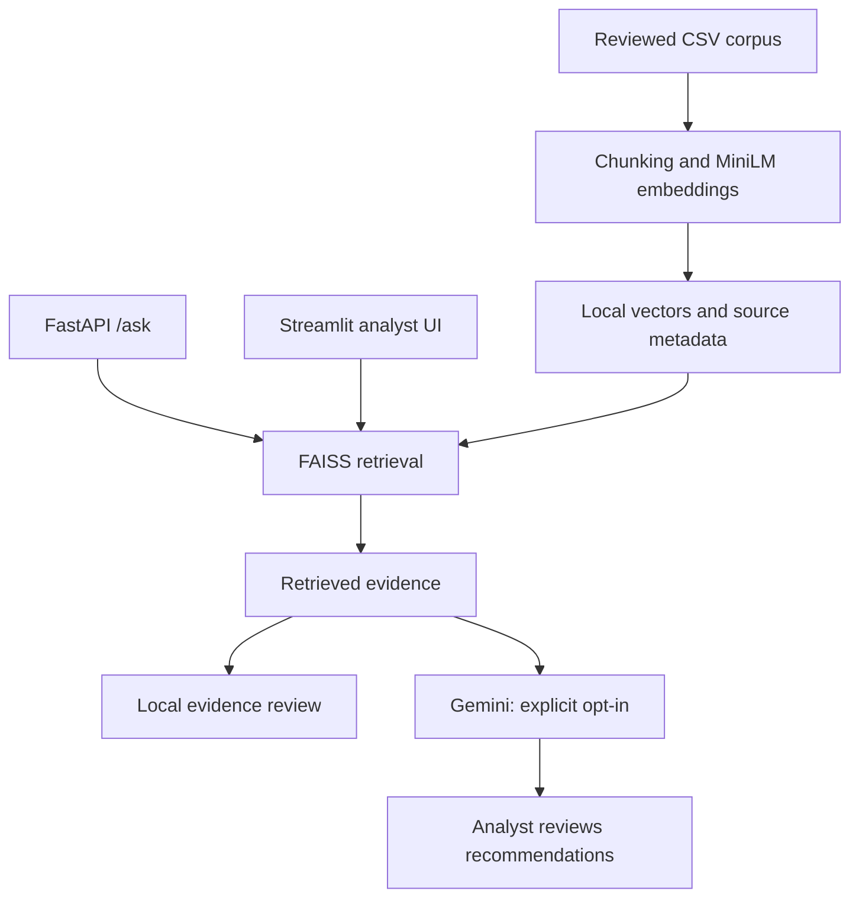

# Advanced Threat Emulation & Security Lab

**An enterprise security lab connecting adversary emulation, system hardening, and a retrieval-augmented SOC assistant.**

**Rachid EL MAGROUA · Network & Cybersecurity Engineer**  
[GitHub](https://github.com/rachidelmagrouaIng) · [LinkedIn](https://www.linkedin.com/in/rachid-el-magroua/)

## Why I built this

I built this project to study how weaknesses in an enterprise environment translate into practical attack paths, and how defensive changes affect those paths. The lab combines Windows Active Directory, an Ubuntu web server, controlled attack scenarios, MITRE CALDERA, and a Python assistant that retrieves security context before proposing an analysis.

The engineering focus is the full investigation loop: reproduce a weakness in an isolated environment, inspect the evidence, apply a defensive control, and repeat the test. The assistant supports the analyst with context and proposed rules; enforcement remains a human decision.

## Project at a glance

| Area | Work covered |
| --- | --- |
| Enterprise lab | Windows Server 2019 AD/DNS/DHCP, domain clients, Ubuntu Apache/PHP and SSH, Kali test host |
| Active Directory | LLMNR/NBT-NS poisoning, NTLM relay, IPv6-related authentication redirection, remote WMI execution |
| Web and Linux | SQLite SQL injection, unsafe executable uploads, SSH password attacks and hardening |
| Adversary emulation | CALDERA server and Sandcat agents across Windows and Linux |
| Analyst assistance | CSV ingestion, MiniLM embeddings, FAISS retrieval, Gemini generation, FastAPI and Streamlit |
| Defensive output | Proposed Snort rules, Splunk searches, Fortinet controls and GPO recommendations |

**Start here:** [Engineering case study](docs/case-study.md) · [Scenario matrix](docs/scenarios.md) · [RAG design](docs/rag-design.md) · [Local setup](docs/setup.md)

## Architecture


*Logical lab layout. Connections indicate test paths and service relationships, not a deployable firewall policy. Vulnerable services belong in an isolated lab.*

The public Python implementation exposes two independent interfaces sharing the same service:



## What is included

- A documented security lab with attack paths, mitigation rationale and retest criteria.
- A refactored Python implementation of my LLM + RAG workflow.
- Source-attributed retrieval, an evidence threshold, local retrieval mode, and explicit external-generation controls.
- Synthetic knowledge records and log excerpts for a small demonstration.
- Automated tests and a GitHub Actions workflow for ingestion, retrieval and API behavior.

The full VM environment, proprietary software, raw security datasets, credentials, trained/downloaded model files and generated vector stores are excluded. This repository does not automatically provision the complete lab. The sample corpus demonstrates the workflow and does not reproduce the full lab's knowledge base.

## Quick start

Use **Python 3.11**. Run from the repository root. Initial installation and embedding-model download require internet access and can use substantial disk space.

```bash
python -m venv .venv
source .venv/bin/activate
# Windows PowerShell: .venv\Scripts\Activate.ps1
python -m pip install -r requirements.txt
cp .env.example .env
# Windows PowerShell: Copy-Item .env.example .env
python build_index.py --data-dir examples/knowledge
```

Start either interface:

```bash
python -m uvicorn main:app --host 127.0.0.1 --port 8000
# In a separate terminal using the same environment:
python -m streamlit run streamlit_app.py --server.address 127.0.0.1
```

Open the API docs at `http://127.0.0.1:8000/docs` or the UI at `http://127.0.0.1:8501`.

Try local retrieval without an API key:

```bash
curl -X POST http://127.0.0.1:8000/ask \
  -H 'Content-Type: application/json' \
  -d '{"query":"Repeated failed SSH passwords from one source. What should I investigate?","retrieve_only":true}'
```

For optional generation, set `GOOGLE_API_KEY` in your local `.env` and `ALLOW_EXTERNAL_LLM=true`, then restart the application. **Your input and retrieved excerpts will be sent to Google Gemini.** The UI also requests confirmation per analysis. Use only data you are authorized to send. The API follows the operator's environment configuration.

The default model is `gemini-2.5-flash`; model availability and quotas depend on your provider account. Configure `GEMINI_MODEL` as needed. See [setup and troubleshooting](docs/setup.md).

## Repository map

| Path | Purpose |
| --- | --- |
| `build_index.py` | CSV-to-vector build entry point |
| `rag_utils.py` | Re-exports of the retrieval and analysis functions |
| `main.py` | FastAPI `/ask` and `/health` endpoints |
| `streamlit_app.py` | Text/PDF analyst interface |
| `soc_rag/` | Configuration, ingestion, vector retrieval and generation service |
| `examples/` | Synthetic knowledge and log samples |
| `docs/` | Architecture, security scenarios, hardening, setup and evaluation |
| `tests/` | Deterministic checks without model downloads or LLM calls |
| `scripts/` | Repository hygiene check |
| `.github/workflows/` | Lightweight CI |

## Validation and limits

The lab establishes qualitative attack and hardening workflows. This release makes no benchmark claim about detection accuracy, latency, false positives or guaranteed mitigation. [Evaluation](docs/evaluation.md) separates observed lab behavior from validation still needed.

The assistant is a research prototype. Similarity is not attack confidence. Retrieved context can be irrelevant or malicious, and generated explanations, ATT&CK mappings and rule syntax need review. No component deploys firewall rules, runs attack commands, or changes GPOs.

## Development

```bash
python -m pip install -r requirements-test.txt
python -m unittest discover -s tests -v
python scripts/check_repo.py
```

See [CONTRIBUTING.md](CONTRIBUTING.md) for development expectations and [SECURITY.md](SECURITY.md) for data handling and reporting.

## Credits

Repository maintained by **Rachid EL MAGROUA**. Academic lab developed with **Mouhcine FOUZI**, under the supervision of **Zineb BAKRAOUY**, for the Cybersecurity module. My Python component connects log retrieval with LLM-assisted analysis and defensive recommendations.

Third-party software and models retain their respective licenses. Dataset owners retain rights to their data. No license to redistribute third-party datasets or VM images is implied.
