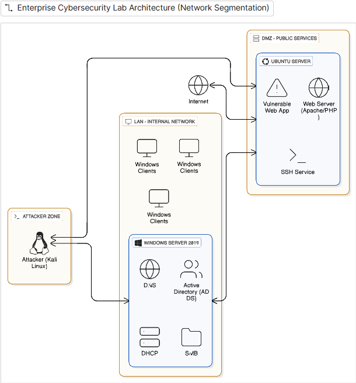
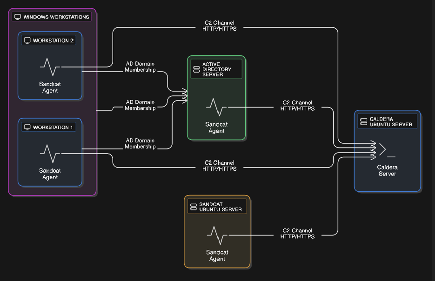

# Lab architecture

The lab has an internal Windows domain, an Ubuntu web/SSH server in a logical service zone, and a Kali test host. Windows Server 2019 supplies Active Directory, DNS, DHCP and SMB services. Domain workstations provide client authentication behavior for the Windows scenarios.

This is a logical topology; it omits real addressing and credentials. It does not establish that every depicted flow is permitted in a secure deployment. Restrict vulnerable workloads to an isolated test network and explicitly allow only the paths needed by each scenario.

## CALDERA

The CALDERA server coordinates Sandcat agents on Windows and Ubuntu hosts over HTTP/HTTPS. Use dedicated lab hosts, scoped emulation operations and cleanup procedures. Deployment to domain controllers is a sensitive lab experiment and is not a production recommendation.

Before an operation, record the authorized target set and expected telemetry. Afterward, distinguish agent connectivity, ability execution, observable activity and detection success. None of these implies the next automatically.

## Integration boundary

The Python assistant accepts analyst-supplied text or text extracted from PDF. The index builder consumes CSV files. There is no live SIEM feed, CALDERA API integration, firewall connector or automatic response executor in this release.

FastAPI and Streamlit are independent entry points into the same Python service. Streamlit does not call the HTTP API. Snort, Splunk, Fortinet and GPO appear as recommendation targets; their deployment and verification remain external to the assistant.
